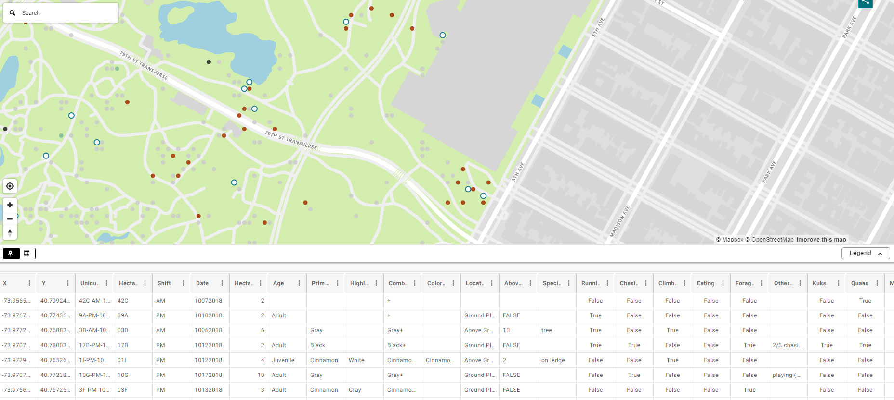

# 03 Squirrel Census Data Analysis(with Pandas)
> 2018 Central Park Squirrel Census - Squirrel Data
> https://data.cityofnewyork.us/Environment/2018-Squirrel-Census-Fur-Color-Map/fak5-wcft



### Objective:
* Download the csv file from the website
* Select the Primary Fur Color
* Calculate the amount number of color: gray,cinnamon, black
* Create a csv file named 'squirrel_count', and the content is:
```python
,Fur Color,Count
0,gray,2473
1,cinnamon,392
2,black,103
```

## Steps
### 01 Import pandas & .read.csv

```python
import pandas

data = pandas.read_csv("Dictionary/2018_Central_Park_Squirrel_Census_-_Squirrel_Data.csv")

# hold the column
fur_color_count = data["Primary Fur Color"]
```
### 02 Filter the color column & count  
```python
# Filter the gray squirrels row, use len() to account the number
grey_squirrels_count = len(data[data["Primary Fur Color"] == "Gray"])
cinnamon_squirrels_count = len(data[data["Primary Fur Color"] == "Cinnamon"])
black_squirrels_count = len(data[data["Primary Fur Color"] == "Black"])

# print(grey_squirrels_count)
# print(cinnamon_squirrels_count)
# print(black_squirrels_count)
```
### 03 Make a dictionary & Create a csv file
```python
data_color_dict = {
    "Fur Color": ["gray","cinnamon","black"],
    "Count": [grey_squirrels_count, cinnamon_squirrels_count, black_squirrels_count]
}

data_color = pandas.DataFrame(data_color_dict)
data_color.to_csv("squirrel_count.csv")
```

