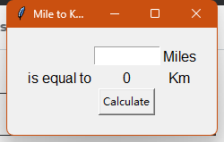
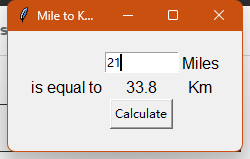

# Intro GUI & Tkinter

## Basic experience
### 1.1 class Label & pack method
```python

import tkinter


# Set window
window = tkinter.Tk()
window.title("My first GUI program")
window.minsize(width=500, height=300)

# Create a component inside the window
# Label class
# Specify how that component is going to be laid out on the screen
my_label = tkinter.Label(text="I am a Label", font=("Arial", 24, "bold"))
my_label.pack()
```
### 1.2 Adjust
```python
my_label["text"] = "New text"

# or
my_label.config(text="Hahaha")
```
Note: if you want to import more class, use *
```python
from tkinter import *
```
### 1.3 class Button
```python
def button_clicked():
    print("I got clicked")


button = Button(text="Click Me", command=button_clicked)
button.pack()
```
### 1.4 class Entry
```python
input = Entry(width=10)
input.pack()
```
### 1.5 end the code

```python
# keep the window on the screen
window.mainloop()
```


## 2 pack, place, grid
*cannot use pack and grid together
```python
label.pack
label.place(x=10, y=50)
label.grid(column=0, row=0)
```




```python
from tkinter import *

FONTS = ("Arial", 12)


def button_clicked():
    print("I get calculate")
    result = round(1.60934 * int(my_input.get()), 2)
    label_4["text"] = result


window = Tk()
window.title("Mile to Km Converter")
window.minsize(width=200, height=120)
window.config(padx=20, pady=20)

label_1 = Label(text="is equal to", font=FONTS)
label_2 = Label(text="Miles", font=FONTS)
label_3 = Label(text="Km", font=FONTS)
label_4 = Label(text="0", font=FONTS)

label_1.grid(column=12, row=12)
label_2.grid(column=24, row=6)
label_3.grid(column=24, row=12)
label_4.grid(column=16, row=12)

my_input = Entry(width=10)
my_input.grid(column=16, row=6)

button = Button(text="Calculate", command=button_clicked)
button.grid(column=16, row=18)

window.mainloop()

```