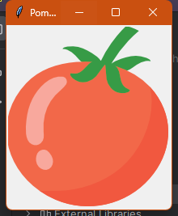

# Pomodoro program - 01
___
## Objective:
* In this part we are going to finish like this:


___
## Steps：

Thinking about how to separate each steps:
1. import tkinter
2. set a window (title, )


## 01 UI SETUP
### 1.1 Set a window
```python
from tkinter import *  # we use '*' for import more class from tkinter

window = Tk()
window.title("Pomodoro")
# <-----WRITE YOUR CODE BELOW--------->


# <-----WRITE YOUR CODE ABOVE--------->
window.mainloop()  # keep the window on the screen
```
The window will be show like this:


___
### 1.2 Import the pomodoro image
#### 1. Use canvas widgets
#### 2. Check the image size that we are going to use.


#### 3. Add size information into Canvas()
#### 4. Import image 

```python
canvas = Canvas(width=200, height=224)
tomato_img = PhotoImage(file="tomato.png")
canvas.create_image(100, 112, image=tomato_img)
canvas.pack()
```
Note: be aware of canvas.create_image(*args, **kw), we need put the x and y position at first.
____

When you finish this step. The window will be show like this:



#### 5. More space for window

```python
window.config(padx=100, pady=50)
```


Note: You can adjust the image position by change canvas.create_image(103, 112, image=tomato_img)
____

### 1.3 Time on the tomato
* Create a global font name 
* Use .create_text method
```python
FONT_NAME = "Courier"

canvas.create_text(103, 130, text="00:00", fill="white", font=(FONT_NAME, 35, "bold"))
```

When you finish this step. The window will be show like this:

___
### 1.4 Background Color [ ! ]
* https://colorhunt.co/ to select the color you want
* grab these color
```python
PINK = "#e2979c"
RED = "#e7305b"
GREEN = "#9bdeac"
YELLOW = "#f7f5dd"
```
#### 1.4.1 window background
```python
window.config(padx=100, pady=50, bg=YELLOW)
```
#### 1.4.2 image background
```python
canvas = Canvas(width=200, height=224, bg=YELLOW)
```
* You might find the edge of color is annoying. 
* By using highlightthickness=0 to solve this problem. 
* It might need to adjust the image position in canvas.create_image()


```python
# <--- UI Setup --->
window = Tk()
window.title("Pomodoro")
window.config(padx=100, pady=50, bg=YELLOW)


# Canvas widgets
canvas = Canvas(width=200, height=224, bg=YELLOW, highlightthickness=0)
tomato_img = PhotoImage(file="tomato.png")
canvas.create_image(100, 112, image=tomato_img)
canvas.create_text(103, 130, text="00:00", fill="white", font=(FONT_NAME, 35, "bold"))
canvas.pack()

window.mainloop()
```

## 02 UI Complete

___

## Steps：

Thinking about how to separate each steps:
1. Label on the screen
2. Button (Start & Reset)
3. Check mark (copy-paste the checkmark symbol)
4. Use fg to color the foreground
5. Use grid() instead of pack()


### 1.1 Use grid() instead of pack()
```python
canvas.grid(column=2, row=2)
```
### 1.2 Label 
```python
# Label timer
label_timer = Label(text="Timer", fg=GREEN, bg=YELLOW, font=(FONT_NAME, 45, "bold"))
label_timer.grid(column=1, row=0)

# Checkmark
label_check = Label(text="✔", fg=GREEN, bg=YELLOW, font=(FONT_NAME, 15, "bold"))
label_check.grid(column=1, row=3)
```
### 1.3 Button 
```python
# Button
button_start = Button(text="Start", fg="black", font=("Arial", 10, "bold"))
button_start.grid(column=0, row=2)
button_reset = Button(text="Reset", fg="black", font=("Arial", 10, "bold"))
button_reset.grid(column=2, row=2)
```
When you finish this step, it shows like this:


### Full code in UI part
```python
from tkinter import *

PINK = "#e2979c"
RED = "#e7305b"
GREEN = "#9bdeac"
YELLOW = "#f7f5dd"
FONT_NAME = "Courier"
WORK_MIN = 25
SHORT_BREAK_MIN = 5
LONG_BREAK_MIN = 20

window = Tk()
window.title("Pomodoro")
window.config(padx=100, pady=50, bg=YELLOW)

canvas = Canvas(width=200, height=224, bg=YELLOW, highlightthickness=0)
tomato_img = PhotoImage(file="tomato.png")
canvas.create_image(100, 112, image=tomato_img)

canvas.create_text(103, 130, text="00:00", fill="white", font=(FONT_NAME, 35, "bold"))
canvas.grid(column=1, row=1)

# Label timer
label_timer = Label(text="Timer", fg=GREEN, bg=YELLOW, font=(FONT_NAME, 45, "bold"))
label_timer.grid(column=1, row=0)
# Checkmark
label_check = Label(text="✔", fg=GREEN, bg=YELLOW, font=(FONT_NAME, 15, "bold"))
label_check.grid(column=1, row=3)

# Button
button_start = Button(text="Start", fg="black", font=("Arial", 10, "bold"))
button_start.grid(column=0, row=2)
button_reset = Button(text="Reset", fg="black", font=("Arial", 10, "bold"))
button_reset.grid(column=2, row=2)

window.mainloop()

```
