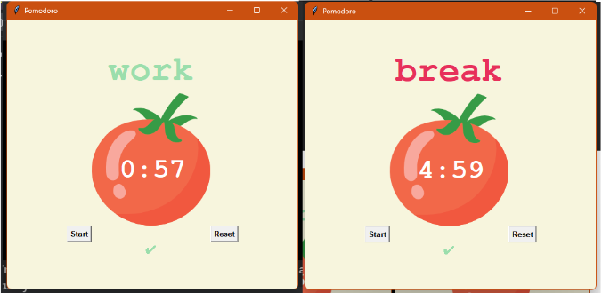
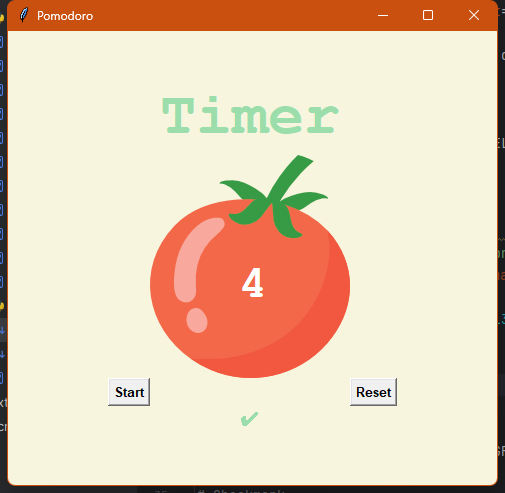
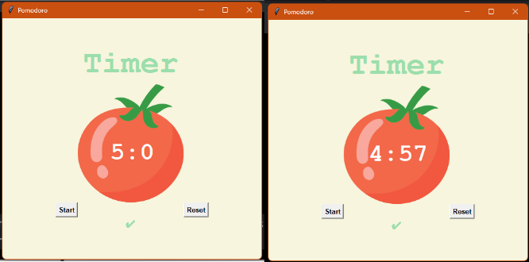
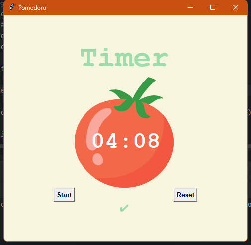

# Pomodoro program - 02
___
## Objective:
* Add more funtion in this program 
* In this part we are going to finish like this:


___

## Steps：

## 01 normal count down
### Use .after
```python
def countdown(count):
    print(count)
    if count > 0:
        window.after(1000, countdown, count - 1)

        
countdown(5)
```
Console:
```python
5
4
3
2
1
0
```
## 02 Update on screen
### 2.1 simple number count
* change the def countdown(count)
* change canvas.create_text into a variable
```python
def countdown(count):
    canvas.itemconfig(timer_text, text=count)
    if count > 0:
        window.after(1000, countdown, count - 1)

        
timer_text = canvas.create_text(103, 130, text="00:00", fill="white", font=(FONT_NAME, 35, "bold"))
     

# move the countdown method after canvas
countdown(5)
```



### 2.2 start timer
#### 2.3.1 def start_timer() and interact
```python
def start_timer():
    countdown(5)

    
# add a command
button_start.config(command=start_timer)
```
#### 2.3.2 count down minute
change the code :
```python
def start_timer():
    countdown(5 * 60)
    
    
def countdown(count):
    # 01:35
    count_min = count // 60
    count_sec = count % 60
    canvas.itemconfig(timer_text, text=f"{count_min}:{count_sec}")

    if count > 0:
        window.after(1000, countdown, count - 1)
```


#### 2.3.3 Dynamic typing explained
change the code:
```python
def countdown(count):
    # 01:35
    count_min = count // 60
    count_sec = count % 60

    if count_sec == 0:
        count_sec = "00"
    elif count_sec < 10:
        count_sec = f"0{count_sec}"
    canvas.itemconfig(timer_text, text=f"{count_min}:{count_sec}")

    if count > 0:
        window.after(1000, countdown, count - 1)
```



## 03 work-short break-work-....long break
```python
reps = 0

def start_timer():
    global reps
    reps += 1
    work_sec = WORK_MIN * 60
    short_break_sec = SHORT_BREAK_MIN * 60
    long_break_sec = LONG_BREAK_MIN * 60
    
    if reps % 8 == 0:
        countdown(long_break_sec)

    elif reps % 2 == 0:
        countdown(short_break_sec)
    
    else:
        countdown(work_sec)
```
Note: could also use:
```python
    if reps in (1, 3, 5, 7):
        countdown(work_sec)

    elif reps in (2, 4, 6):
        countdown(short_break_sec)

    elif reps == 8:
        countdown(long_break_sec)

    elif reps == 9:
        reps = 0
```
* You still need to change def countdown() to loop it.
* add 'else:'
```python
def countdown(count):
    # 01:35
    count_min = count // 60
    count_sec = count % 60

    if count_sec == 0:
        count_sec = "00"
    elif count_sec < 10:
        count_sec = f"0{count_sec}"
    canvas.itemconfig(timer_text, text=f"{count_min}:{count_sec}")

    if count > 0:
        window.after(1000, countdown, count - 1)
    else:
        start_timer()
```

## 04 add work break show on the screen instead of timer
```python
    if reps % 8 == 0:
        countdown(long_break_sec)
        label_timer.config(text="break", fg=PINK)

    elif reps % 2 == 0:
        countdown(short_break_sec)
        label_timer.config(text="break", fg=RED)

    else:
        countdown(work_sec)
        label_timer.config(text="work", fg=GREEN)
```

