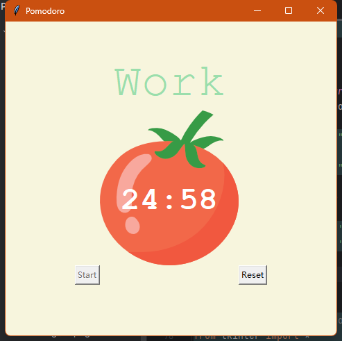

# Pomodoro program - 03
___
## Objective:
* Adding checkmarks and resetting the application.
* In this part we are going to finish like this:



___
## Steps：

## 01 checkmark add
* add one checkmark for every two reps.
```python
def countdown(count):
    # 1:35
    count_min = count // 60
    count_sec = count % 60

    if count_sec == 0:
        count_sec = "00"
    elif count_sec < 10:
        count_sec = f"0{count_sec}"
    canvas.itemconfig(timer_text, text=f"{count_min}:{count_sec}")

    if count > 0:
        window.after(1000, countdown, count - 1)
    else:
        start_timer()
        # add one checkmark for every two reps.
        marks = ""
        work_sessions = math.floor(reps/2)
        for _ in range(work_sessions):
            marks += "✔"
        label_check.config(text=marks))
```
* change the label_check, erase the checkmark
```python
label_check = Label(text=" ", fg=GREEN, bg=YELLOW, font=(FONT_NAME, 15, "bold"))
```
## 02 reset program
### 2.1 inside start_time()
```python
    if count > 0:
        global timer
        timer = window.after(1000, count_down, count - 1)
```
### 2.2 add a global variable
```python
timer = None
```
### 2.3 finish def reset_timer()
```python
def reset_timer():
    window.after_cancel(timer)
    canvas.itemconfig(timer_text, text="00:00")
    label_timer.config(text="Timer")
    label_check.config(text="")
    global reps
    reps = 0
```
### 2.4 other issue
#### 2.4.1 multi click start will lead a strange bug
use code below could control the button
```python
start_button.config(state="disabled")

start_button.config(state="normal")
```
#### 2.4.2 still work when minimize window
```python
        window.attributes('-topmost', 1)
        window.attributes('-topmost', 0)
```


## Full code
```python
# Based on Angela Yu's tutorial
from tkinter import *
import math

# ---------------------------- CONSTANTS ------------------------------- #
PINK = "#e2979c"
RED = "#e7305b"
GREEN = "#9bdeac"
YELLOW = "#f7f5dd"
FONT_NAME = "Courier"
WORK_MIN = 25
SHORT_BREAK_MIN = 5
LONG_BREAK_MIN = 20
reps = 0
timer = None


# ---------------------------- TIMER RESET ------------------------------- #
def reset_timer():
    start_button.config(state="normal")
    window.after_cancel(timer)
    canvas.itemconfig(timer_text, text="00:00")
    title_label.config(text="Timer")
    check_marks.config(text="")
    global reps
    reps = 0


# ---------------------------- TIMER MECHANISM ------------------------------- #

def start_timer():
    start_button.config(state="disabled")
    global reps
    reps += 1

    work_sec = WORK_MIN * 60
    short_break_sec = SHORT_BREAK_MIN * 60
    long_break_sec = LONG_BREAK_MIN * 60

    if reps % 8 == 0:
        count_down(long_break_sec)
        title_label.config(text="Break", fg=RED)
    elif reps % 2 == 0:
        count_down(short_break_sec)
        title_label.config(text="Break", fg=PINK)
    else:
        count_down(work_sec)
        title_label.config(text="Work", fg=GREEN)


# ---------------------------- COUNTDOWN MECHANISM ------------------------------- #
def count_down(count):
    count_min = math.floor(count / 60)
    count_sec = count % 60
    if count_sec < 10:
        count_sec = f"0{count_sec}"

    canvas.itemconfig(timer_text, text=f"{count_min}:{count_sec}")
    if count > 0:
        global timer
        timer = window.after(1000, count_down, count - 1)
    else:
        start_timer()
        marks = ""
        work_sessions = math.floor(reps / 2)
        for _ in range(work_sessions):
            marks += "✔"
        check_marks.config(text=marks)
        window.attributes('-topmost', 1)
        window.attributes('-topmost', 0)


# ---------------------------- UI SETUP ------------------------------- #
window = Tk()
window.title("Pomodoro")
window.config(padx=100, pady=50, bg=YELLOW)

title_label = Label(text="Timer", fg=GREEN, bg=YELLOW, font=(FONT_NAME, 50))
title_label.grid(column=1, row=0)

canvas = Canvas(width=200, height=224, bg=YELLOW, highlightthickness=0)
tomato_img = PhotoImage(file="tomato.png")
canvas.create_image(100, 112, image=tomato_img)
timer_text = canvas.create_text(100, 130, text="00:00", fill="white", font=(FONT_NAME, 35, "bold"))
canvas.grid(column=1, row=1)

start_button = Button(text="Start", highlightthickness=0, command=start_timer)
start_button.grid(column=0, row=2)

reset_button = Button(text="Reset", highlightthickness=0, command=reset_timer)
reset_button.grid(column=2, row=2)

check_marks = Label(fg=GREEN, bg=YELLOW)
check_marks.grid(column=1, row=3)

window.mainloop()

```