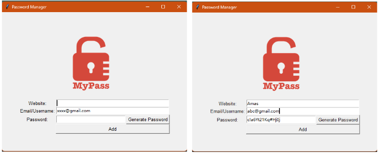
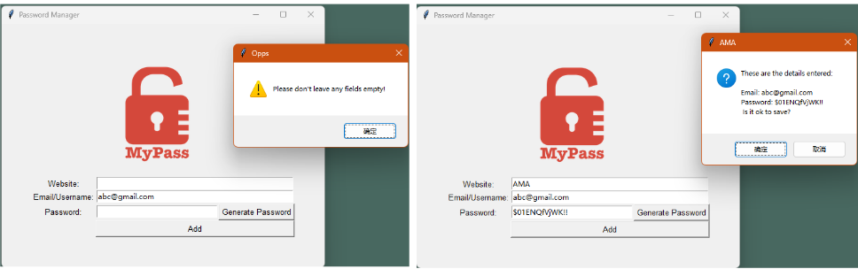
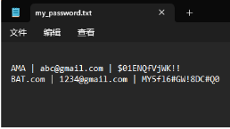
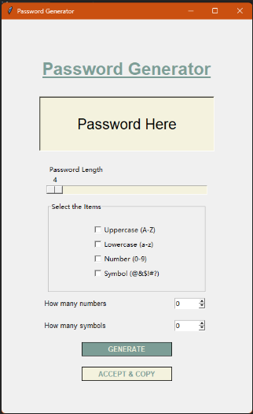

# Password manager
___
## Objective
___
* Safely storage your password and account in your computer

* Warning & Show the info

* When you add info it will save it in a file 'my_password.txt'

## TODO list

* Furthermore, generator will be updated later
* It will pop up when user click Generate Password

